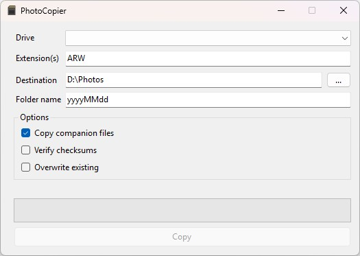

# PhotoCopier

Small utility which helps with copying photos from SD cards to a folder on your computer.

### How to use?

1. Start PhotoCopier
2. Select SD card from dropdown
3. Select location on your hard drive
4. Click copy
